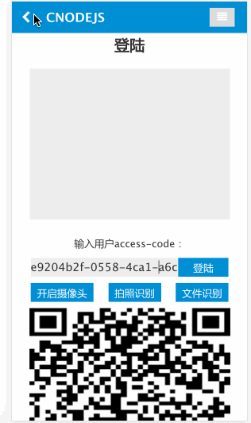

#cnode-react
使用react开发的cnodejs客户端

探索react开发webapp的过程
## Features
- 使用ruanyifeng老师的[react-babel-webpack-boilerplate](git@github.com:ruanyf/react-babel-webpack-boilerplate.git)的webpack项目配置
- 使用cnode论坛提供的接口开发
- 实现下拉加载功能
- 对全局滚动和布局滚动进行了一些探索
    全局滚动性能远优于局部滚动
- markdown输入组件，模拟锤子便签markdown的设计
    可预览编辑效果
- 登陆优化
    实现html图片和拍照识别二维码（系统原因不可使用后置摄像头）


## 启动过程

- 启动调试

```bash
$ npm start
```

http://localhost:8080.

- 生成发布文件

```bash
$ npm run deploy
```


## License

MIT
